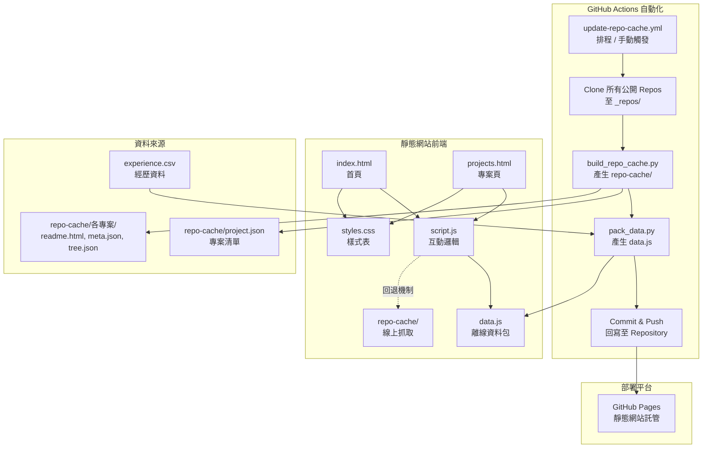
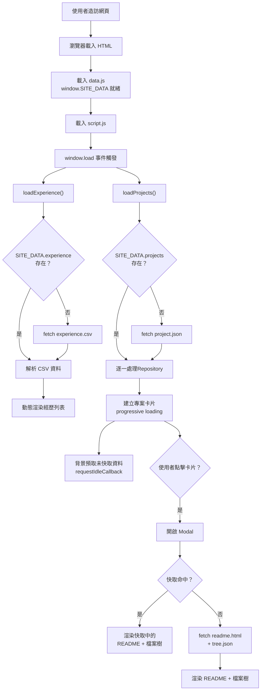
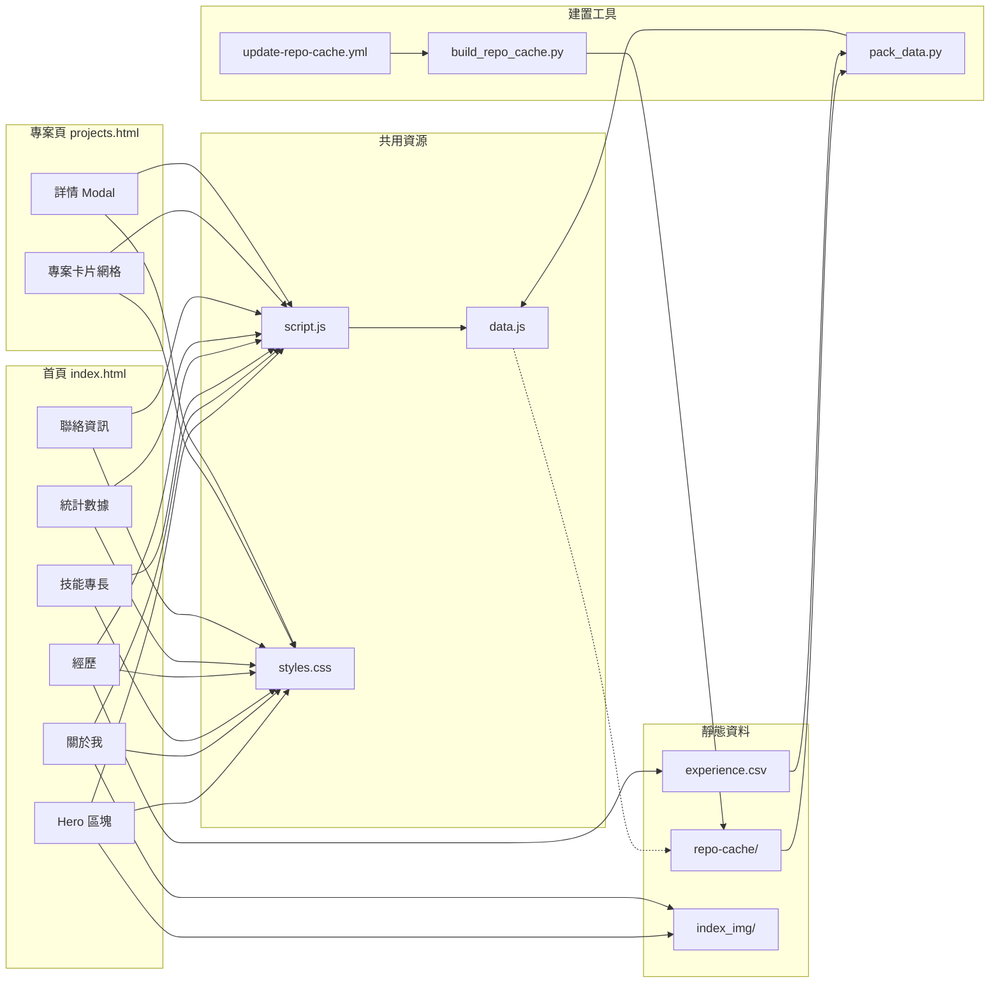

# Personal Website - Academic Portfolio

## 專案總覽（Project Overview）

本專案為一個**靜態個人學術作品集網站**，用於展示網站擁有者（王俊凱）的個人簡介、技能專長、學術經歷、研究專案作品等資訊。

- **專案用途**：提供一個專業的線上個人履歷與作品集入口，讓訪客能快速了解擁有者的背景、研究方向、開源專案成果
- **解決的問題**：集中呈現分散在各 GitHub Repository 中的專案資訊，自動同步最新的 README 與檔案結構，免除手動更新的維護成本
- **使用對象**：任何對擁有者背景、研究或專案感興趣的訪客（招募方、研究合作者、學術同儕等）
- **專案性質**：靜態網站應用（Static Site），透過 GitHub Pages 部署，搭配 GitHub Actions 自動化資料更新

[](https://gkwang4912.github.io/personal_website/)

---

## 系統架構說明（Architecture Overview）

整體系統由三大部分組成：

1. **前端展示層**：純 HTML + CSS + JavaScript 的靜態網頁，分為首頁（`index.html`）與專案頁（`projects.html`）兩個主要頁面，共用 `styles.css` 與 `script.js`
2. **資料層**：專案資料以離線快取的形式儲存在 `repo-cache/` 資料夾中（包含每個 Repository 的 `readme.html`、`meta.json`、`tree.json`），並由 `data.js` 將所有資料打包為全域變數 `window.SITE_DATA`，供前端直接讀取
3. **自動化建置層**：GitHub Actions 工作流程（`update-repo-cache.yml`）定時或在推送變更時自動拉取所有公開 Repository 的快照，透過 Python 腳本（`build_repo_cache.py`）產生快取檔案，再由 `pack_data.py` 打包成 `data.js`

### 模組間依賴關係

- `index.html` 與 `projects.html` 依賴 `styles.css`（樣式）與 `script.js`（互動邏輯）
- `script.js` 依賴 `data.js`（離線資料來源）或 `repo-cache/` 資料夾（線上回退）
- `data.js` 由 `scripts/pack_data.py` 根據 `repo-cache/` 內容與 `experience.csv` 自動產生
- `repo-cache/` 由 `scripts/build_repo_cache.py` 根據 GitHub Repository 內容自動產生
- GitHub Actions 串聯上述兩個 Python 腳本，定時觸發完整建置流程



---

## 系統流程說明（System Flow）

### 主要執行流程

系統有兩條主要流程：

1. **資料建置流程**：由 GitHub Actions 定時或手動觸發，自動更新所有專案的快取資料
2. **前端載入流程**：使用者造訪網頁時，前端 JavaScript 從 `data.js` 讀取資料並渲染畫面

### 資料建置流程

1. GitHub Actions 按 cron 排程（每日 UTC 16:00，台北時間午夜 00:00）、推送至 main 分支時、或手動觸發
2. 使用 GitHub API 取得使用者 `gkwang4912` 的所有公開、非 fork、非歸檔 Repository 清單（排除 `personal_website` 本身）
3. 逐一 shallow clone（`--depth=1`）各 Repository 至 `_repos/` 暫存目錄
4. `build_repo_cache.py` 掃描 `_repos/`，為每個 Repository 產生：目錄樹（`tree.json`）、README HTML（`readme.html`）、中繼資料（`meta.json`），以及總索引（`project.json`）
5. `pack_data.py` 讀取 `repo-cache/` 全部內容與 `experience.csv`，打包為單一 `data.js` 檔案
6. 若有變更，自動 commit 並 push 回 Repository

### 前端載入流程

1. 瀏覽器載入 `index.html` 或 `projects.html`
2. `data.js` 先行載入，將所有資料以 `window.SITE_DATA` 寫入全域
3. `script.js` 在 `window.load` 事件中呼叫 `loadExperience()` 與 `loadProjects()`
4. `loadExperience()` 從 `SITE_DATA.experience` 或直接 fetch `experience.csv` 讀取經歷資料並動態渲染
5. `loadProjects()` 從 `SITE_DATA.projects` 讀取專案清單，逐一建立專案卡片（progressive loading），每張卡片帶有交錯動畫
6. 所有卡片載入完成後，背景以 `requestIdleCallback` 預取（prefetch）尚未快取的專案 README 與 tree 資料
7. 使用者點擊專案卡片時，開啟 Modal 視窗顯示 README 內容與檔案結構樹



---

## 資料夾結構說明（Folder Structure）

```
personal_website/
├── .github/
│   └── workflows/
│       └── update-repo-cache.yml   # GitHub Actions 自動化工作流程
├── .nojekyll                       # 告知 GitHub Pages 不使用 Jekyll 處理
├── index.html                      # 首頁（個人簡介、技能、經歷、統計、聯絡）
├── projects.html                   # 專案展示頁（含 Modal 詳情檢視）
├── styles.css                      # 全站共用樣式（約 62KB）
├── script.js                       # 全站共用互動邏輯（約 900 行）
├── data.js                         # 由 pack_data.py 自動產生的離線資料包
├── experience.csv                  # 經歷資料 CSV（論文、競賽、研究計畫）
├── index_img/                      # 首頁用圖片資源
│   ├── 1.png                       # 個人頭像
│   └── 2.png                       # 關於我區塊照片
├── scripts/                        # 建置腳本目錄
│   ├── build_repo_cache.py         # 從 clone 的 repo 建立快取（tree/readme/meta）
│   └── pack_data.py                # 將 repo-cache + experience.csv 打包為 data.js
└── repo-cache/                     # 專案快取資料（由 GitHub Actions 自動維護）
    ├── project.json                # 所有專案索引清單
    └── gkwang4912__<RepoName>/     # 每個 Repository 各一個子資料夾
        ├── readme.html             # README.md 轉換後的 HTML
        ├── meta.json               # Repository 中繼資料（owner, repo, head commit）
        └── tree.json               # Repository 檔案目錄樹結構
```

| 資料夾/檔案            | 用途說明                                       |
| ---------------------- | ---------------------------------------------- |
| `.github/workflows/` | 存放 GitHub Actions 工作流程定義               |
| `index_img/`         | 首頁使用的靜態圖片資源                         |
| `scripts/`           | Python 建置腳本，由 CI/CD 流程呼叫             |
| `repo-cache/`        | 自動產生的專案快取資料，前端直接讀取或回退使用 |

---

## 核心模組與重要檔案（Key Modules & Files）

### `index.html` -- 首頁

首頁包含以下區塊：導航列（Navbar）、Hero 全螢幕背景（含粒子動畫）、關於我（About）、技能專長（Skills）、經歷（Experience，從 CSV 動態載入）、統計數據（Stats，含計數動畫）、聯絡資訊（Contact）。引用 Google Fonts（Open Sans + Noto Sans TC）。

### `projects.html` -- 專案展示頁

專案頁包含：頁面標題區、專案卡片網格（由 JavaScript 動態產生）、專案詳情 Modal（含 README 渲染與檔案樹展示、行動裝置 Tab 切換）。引入 Mermaid.js 以渲染 README 中的 Mermaid 圖表。

### `script.js` -- 前端互動邏輯

包含以下功能模組：

| 模組區段               | 功能                                                                         |
| ---------------------- | ---------------------------------------------------------------------------- |
| Navigation             | 導航列滾動效果、行動選單切換、錨點平滑捲動、當前區段高亮                     |
| Reveal Animations      | 基於 IntersectionObserver 的捲動入場動畫（左移/右移/上移）                   |
| Skill Bars Animation   | 技能進度條動態填充動畫                                                       |
| Counter Animation      | 統計數字計數動畫                                                             |
| Particle Animation     | Hero 區塊背景粒子效果                                                        |
| Typing Effect          | Hero 標語打字機效果                                                          |
| Experience CSV Loading | CSV 解析、資料讀取、經歷列表動態渲染（含顏色標籤）                           |
| Projects Loading       | 專案清單讀取、卡片建立、progressive loading、背景預取（prefetch）            |
| Modal Logic            | 專案詳情彈窗邏輯（開啟/關閉/Tab 切換/Mermaid 渲染/README 渲染/圖片尺寸修正） |

### `styles.css` -- 全站樣式

包含所有頁面的完整樣式定義（約 62KB），涵蓋導航列、Hero、About、Skills、Experience、Stats、Contact、Projects Grid、Modal、回到頂部按鈕、動畫效果等所有 UI 元件的樣式。

### `data.js` -- 離線資料包

由 `pack_data.py` 自動產生，以 `window.SITE_DATA = {...}` 的形式將所有資料打包為一個全域 JavaScript 物件，供前端 `script.js` 直接存取。包含：`experience`（CSV 原文）、`projects`（project.json 內容）、`repo_files`（各專案的 readme/meta/tree）。

### `scripts/build_repo_cache.py` -- 快取建置腳本

- 掃描 `_repos/` 目錄中的所有 Repository
- 使用 `git ls-tree` 建立檔案目錄樹
- 將 `README.md` 透過 Python `markdown` 套件轉換為 HTML
- 產生 `meta.json`（owner/repo/head commit/產生時間）
- 輸出總索引 `project.json`

### `scripts/pack_data.py` -- 資料打包腳本

- 讀取 `experience.csv` 原文
- 讀取 `repo-cache/project.json` 取得專案索引
- 讀取每個專案的 `readme.html`、`meta.json`、`tree.json`
- 將所有資料合併為單一 JSON 物件，輸出為 `data.js`

### `.github/workflows/update-repo-cache.yml` -- CI/CD 工作流程

定時、推送至 main 分支時、或手動觸發的 GitHub Actions 工作流程，執行以下步驟：checkout 本專案、透過 GitHub API 取得所有公開 repo 清單（排除 fork/archived/personal_website）、shallow clone 各 repo、執行 `build_repo_cache.py` 產生快取、執行 `pack_data.py` 打包 `data.js`、commit 並 push 變更。推送觸發器使用 `paths-ignore` 排除 `repo-cache/` 和 `data.js` 以避免自我觸發迴圈。



---

## 安裝與環境需求（Installation & Requirements）

### 系統需求

- 任何支援現代瀏覽器的作業系統（Windows / macOS / Linux）
- Git（用於版本控制與 clone）

### 前端（無需安裝）

本專案為純靜態網站，無需 Node.js 或任何前端建置工具。直接開啟 `index.html` 即可在本機瀏覽。

### 建置腳本（選用）

若需在本機執行資料建置腳本：

- **Python 3.11+**
- **相依套件**：`markdown`（用於 README.md 轉 HTML）

安裝方式：

```bash
pip install markdown
```

### 外部服務依賴

| 服務             | 用途                                | 必要性             |
| ---------------- | ----------------------------------- | ------------------ |
| GitHub Pages     | 網站託管                            | 部署時必要         |
| GitHub Actions   | 自動化建置                          | 定時更新快取時必要 |
| GitHub API       | 取得公開 Repository 清單            | 建置腳本使用       |
| Google Fonts CDN | 字體載入（Open Sans, Noto Sans TC） | 前端顯示           |
| devicons CDN     | 技能圖示                            | 前端顯示           |
| Mermaid.js CDN   | README 中的 Mermaid 圖表渲染        | 專案頁使用         |

### 環境變數

本專案不依賴任何環境變數。GitHub Actions 使用 `GITHUB_TOKEN`（自動提供）進行 push 操作。

---

## 使用方式（How to Use）

### 本機開發預覽

1. Clone 本專案：

   ```bash
   git clone https://github.com/gkwang4912/personal_website.git
   cd personal_website
   ```
2. 使用任何本機伺服器預覽（因 `data.js` 需透過 HTTP 載入），例如：

   ```bash
   python -m http.server 8000
   ```

   然後在瀏覽器開啟 `http://localhost:8000`
3. 若直接以檔案方式開啟 `index.html`，資料仍可透過內嵌在 `data.js` 中的 `window.SITE_DATA` 正常載入。

### 更新專案快取（手動）

1. 在本機 Clone 需要快取的 Repository 至 `_repos/` 資料夾（格式：`_repos/<owner>__<repo>`）
2. 安裝 Python 依賴：`pip install markdown`
3. 執行建置腳本：
   ```bash
   python scripts/build_repo_cache.py
   ```
4. 執行打包腳本：
   ```bash
   python scripts/pack_data.py
   ```
5. 產生的 `data.js` 與 `repo-cache/` 即為最新資料

### 更新專案快取（自動）

GitHub Actions 會在以下情況自動執行上述流程：

- **排程**：每日 UTC 16:00（台北時間午夜 00:00）
- **推送觸發**：推送至 main 分支時自動執行（排除 `repo-cache/` 和 `data.js` 的變更以避免迴圈觸發）
- **手動觸發**：在 GitHub Actions 頁面觸發 `workflow_dispatch`

### 修改經歷資料

直接編輯 `experience.csv`，格式為：

```
type,year,title,venue,link
```

修改後重新執行 `python scripts/pack_data.py` 產生更新的 `data.js`，或等待 GitHub Actions 自動處理。

---

## 設定說明（Configuration）

### 可調整的設定項目

本專案沒有獨立的設定檔，可調整項目分散在以下檔案中：

| 設定項目          | 檔案位置                                             | 說明                                                     |
| ----------------- | ---------------------------------------------------- | -------------------------------------------------------- |
| GitHub 使用者名稱 | `.github/workflows/update-repo-cache.yml` 第 16 行 | `USERNAME: gkwang4912`                                 |
| 排除的 Repository | `.github/workflows/update-repo-cache.yml` 第 17 行 | `EXCLUDE_REPO: personal_website`                       |
| 排程時間          | `.github/workflows/update-repo-cache.yml` 第 7 行  | `cron: "0 16 * * *"`（台北時間午夜 00:00）             |
| 個人資訊          | `index.html`                                       | 姓名、角色、學校、Email 等                               |
| 技能項目與百分比  | `index.html` 第 148-195 行                         | 技能名稱與 `data-progress` 屬性                        |
| 統計數據          | `index.html` 第 244-261 行                         | `data-count` 屬性                                      |
| 經歷資料          | `experience.csv`                                   | CSV 格式，type/year/title/venue/link                     |
| 標籤顏色          | `script.js` 第 281-290 行                          | `TAG_COLORS` 陣列                                      |
| 粒子動畫參數      | `script.js` 第 186-243 行                          | 粒子數量、大小、速度、顏色                               |
| 專案標籤推斷規則  | `script.js` 第 561-573 行                          | 副檔名對應技術名稱的 `keywords` 物件                   |
| 資料打包路徑      | `scripts/pack_data.py` 第 7-9 行                   | `REPO_CACHE_DIR`、`EXPERIENCE_FILE`、`OUTPUT_FILE` |

---

## 開發者指南（Developer Guide）

### 建議閱讀順序

1. **`index.html`**：理解首頁結構與各區塊組成
2. **`projects.html`**：理解專案頁結構與 Modal 機制
3. **`script.js`**：理解前端互動邏輯，按區段閱讀（各區段有明確的注解分隔線）
4. **`experience.csv`**：了解經歷資料格式
5. **`scripts/build_repo_cache.py`**：理解快取建置流程
6. **`scripts/pack_data.py`**：理解資料打包流程
7. **`.github/workflows/update-repo-cache.yml`**：理解 CI/CD 自動化流程

### 修改程式時的注意事項

- `data.js` 是自動產生的檔案，不要手動編輯，修改後會被下次建置覆蓋
- `repo-cache/` 目錄中的所有檔案均為自動產生，不要手動修改
- `script.js` 使用 `window.SITE_DATA` 作為主要資料來源，並以 `fetch` 作為回退機制；修改資料載入邏輯時需注意這兩條路徑
- `styles.css` 檔案較大（約 62KB），修改樣式時建議使用瀏覽器 DevTools 定位對應的 CSS 選擇器
- 新增專案時，不需手動處理，只要在 GitHub 上建立新的公開 Repository，Actions 即會自動收錄
- 若要排除特定 Repository，修改 `update-repo-cache.yml` 中的 `EXCLUDE_REPO` 變數（目前僅支援排除單一 repo，需擴充邏輯才能排除多個）

### 模組擴充建議

- **新增頁面**：建立新的 HTML 檔案，引入 `styles.css`、`data.js`、`script.js`，並在導航列中加入連結
- **新增經歷類型**：直接在 `experience.csv` 中新增一行，`TAG_COLORS` 已具備 8 種顏色可自動對應
- **新增技能項目**：在 `index.html` 的 `.skills-bars` 區塊中新增 `.skill-item` 結構
- **客製化專案標籤**：修改 `script.js` 中 `keywords` 物件，新增副檔名與技術名稱對應

---

## 已知限制與待辦事項（Limitations & TODO）

### 已知限制

- `EXCLUDE_REPO` 目前僅支援排除單一 Repository，無法在 YAML 變數中設定多個排除對象
- `experience.csv` 的 CSV 解析器為自行實作的簡易版本，對複雜的 CSV 格式（如欄位內含換行符、雙引號跳脫等）支援有限
- `styles.css` 為單一大型檔案（約 62KB），未進行模組化拆分
- `projects.html` 頁尾的版權文字仍為「您的姓名」而非實際姓名，與 `index.html` 不一致
- 「下載履歷」按鈕（`index.html` 第 130 行）的 `href` 設定為 `#`，尚未關聯實際的履歷檔案
- README 中嵌入的圖片若使用相對路徑，在 Modal 中將無法正確載入（僅 GitHub User Attachments 等完整 URL 可正常顯示）
- 專案頁的 Modal 內 README 渲染依賴外部 CDN（Mermaid.js），離線環境下 Mermaid 圖表將無法正常顯示
- `data.js` 檔案約 199KB，包含所有專案的完整資料，隨著專案增加會持續膨脹

### 可觀察到的待辦事項

- 首頁 `index.html` 中的技能百分比數值（`skill-percent` 文字）與 `data-progress` 屬性值不一致（例如 Machine Learning 顯示 70% 但進度條設定為 90%）
- `projects.html` 的版權年份為 2024，`index.html` 為 2025

---

## 補充說明（Notes）

- 本專案使用 `.nojekyll` 檔案告知 GitHub Pages 跳過 Jekyll 處理，直接提供靜態檔案
- `script.js` 中大量使用 `IntersectionObserver` API 實現捲動觸發動畫，確保效能優於傳統 scroll listener
- 專案卡片的外觀使用基於專案名稱 hash 產生的確定性漸層色（deterministic gradient），不依賴外部圖片
- 前端資料載入機制具備三層回退策略：預取快取 -> `window.SITE_DATA` -> 網路 fetch
- `loadProjects()` 採用 progressive loading 策略，卡片逐一完成後立即插入 DOM，避免長時間空白
- 背景預取（prefetch）利用 `requestIdleCallback`（或降級為 `setTimeout`）在瀏覽器閒置時載入資料，不影響使用者互動體驗
